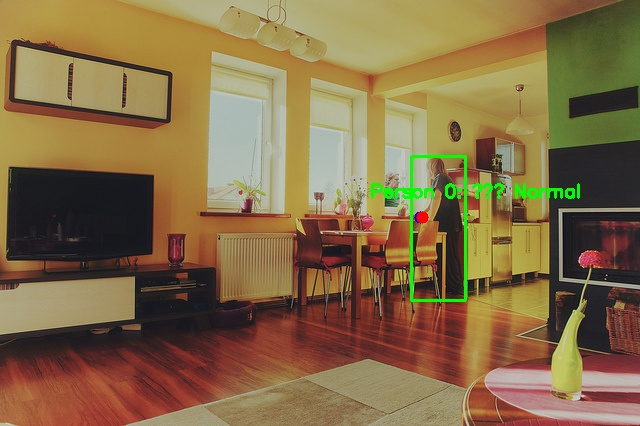
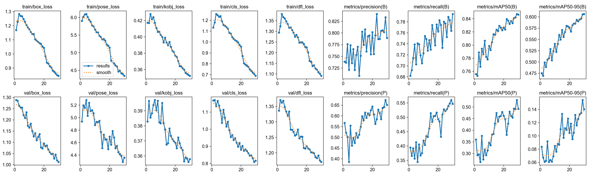
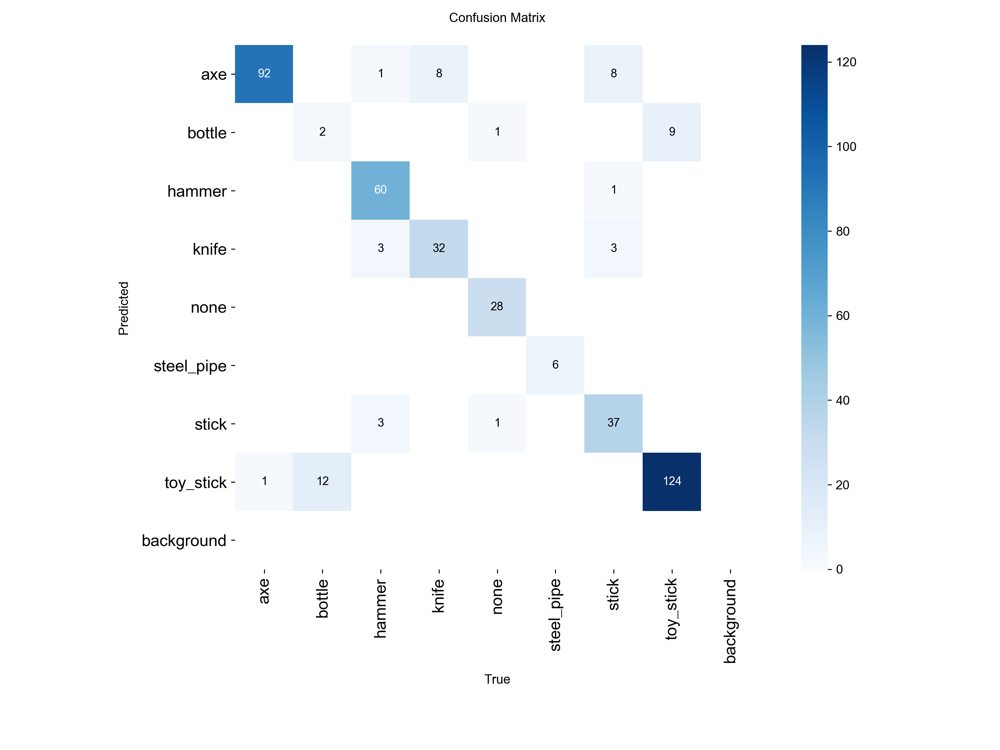

# 人员持械与危险物品异常行为检测 (Armed Behavior Detection)

基于 YOLO-Pose + YOLO 分类的两阶段级联检测系统，实现人员持械/危险物品异常行为的实时识别。

## Method

本系统采用 **两阶段级联检测架构**（Two-Stage Cascade），而非单阶段端到端方案。主要原因是：单阶段方案要求模型同时完成人体定位、手腕关键点提取和危险物品分类三个任务，在有限数据量下难以同时达到高精度；而两阶段级联将复杂任务分解为两个子任务，每个子任务可独立优化、独立评估，且第一阶段（Pose）可以利用 COCO 大规模关键点数据集预训练，第二阶段（分类）可以专注于手部局部图像的细粒度分类。

- **阶段1（YOLOv8n-Pose）**：检测人体边界框并提取 17 个 COCO 关键点，重点关注关键点 9（左手腕）和 10（右手腕）。以手腕关键点为中心，动态计算裁剪窗口大小，确保手部区域在不同距离下保持恒定比例。
- **阶段2（YOLOv8n-cls）**：对手腕裁剪区域进行 9 类分类（axe, bottle, hammer, knife, none, steel_pipe, stick, toy_stick, background），采用独立 Sigmoid 阈值判定（≥0.75 才判为危险品），避免 argmax 导致空手误报。

在工程层面，系统引入三项关键机制解决实际问题：
- **时序平滑 + 状态机**：为每个追踪人员建立 15 帧滑动窗口，告警触发需持械帧数占比 ≥60%，有效解决光照变化和动态模糊导致的单帧误检闪烁。
- **卡尔曼滤波追踪**：简易 KF 预测人体位置，遮挡/交叉时 ID 不丢失，支持跨帧状态连续判定。
- **ROI 区域管理**：支持自定义多边形危险区，以脚底中心点作为判定依据，结合持械时序状态触发区域告警，解决人体俯仰姿态变化导致的误判。

```
架构流程图（文字版）：

输入视频帧
    │
    ▼
┌─────────────────────┐
│  阶段1: YOLOv8n-Pose │
│  人体检测 + 关键点   │
└────────┬────────────┘
         │
    ┌────┴────┐
    │         │
  左手腕    右手腕
  (KP-9)   (KP-10)
    │         │
    ▼         ▼
┌─────────────────────┐
│  动态裁剪窗口        │
│  crop_size = max(   │
│    226, person_w*0.4)│
└────────┬────────────┘
         │
         ▼
┌─────────────────────┐
│  阶段2: YOLOv8n-cls  │
│  9类分类 + Sigmoid   │
│  阈值判定 (≥0.75)    │
└────────┬────────────┘
         │
         ▼
┌─────────────────────┐
│  时序平滑 (15帧窗口) │
│  + 卡尔曼追踪        │
│  + ROI 区域判定      │
└────────┬────────────┘
         │
         ▼
    告警 / 正常
```

> 注：如有现成架构图将替换上述文字流程，或后续使用工具生成可视化流程图。

## Visualizations

以下为系统检测效果与训练结果展示：

| 检测效果 | 训练结果 |
|----------|----------|
|  |  |

| 武器分类混淆矩阵 |
|-----------------|
|  |

演示视频：
- `demo/videos/demo_armed_action.mp4` — 持械行为检测演示
- `demo/videos/demo_roi_rules.mp4` — ROI 区域规则演示

## Evaluations

### 模型精度

#### 阶段1: YOLOv8n-Pose (2026-08-10 重新验证)

| 指标 | 值 |
|------|------|
| Box Precision | 0.771 |
| Box Recall | 0.829 |
| Box mAP50 | 0.875 |
| Box mAP50-95 | 0.673 |
| Pose mAP50 | 0.802 |
| Pose mAP50-95 | 0.534 |
| 验证图片 | 216 张 (232 总, 16 异常) |

> 以上数据来自 2026-08-10 独立验证运行（`runs/pose/val-2/`）。训练时 `results.csv` 记录的 epoch 29 最佳值为 Box mAP50=0.847, Pose mAP50=0.530，两者差异属正常（训练时验证可能含数据增强，独立验证使用干净数据）。

#### 阶段2: YOLOv8n-cls 武器分类

| 指标 | 值 |
|------|------|
| Top-1 Accuracy | 0.882 (best epoch 7) |
| Top-5 Accuracy | 1.000 |
| 分类类别 | 9 类 (axe, bottle, hammer, knife, none, steel_pipe, stick, toy_stick, background) |

### 鲁棒性测试

| 测试维度 | 通过率 | 平均 FPS |
|----------|--------|----------|
| 低光照（亮度 30%） | 5/5 (100%) | 19.43 |
| 运动模糊 | 4/5 (80%) | 45.07 |
| 遮挡测试 | 5/5 (100%) | 27.87 |
| 低分辨率（50%） | 5/5 (100%) | 29.90 |
| **总体** | **19/20 (95%)** | — |

> 以上数据来自 `runs/robustness_results` 实际测试记录。每维度使用 5 张测试图片（共 20 次测试），运动模糊维度有 1 次失败（test_0000 未检测到人体）。测试规模较小，仅供参考。

## Code Structure

```
portfolio/
├── src/
│   ├── train_stage1_pose.py       # 阶段1训练入口：YOLOv8n-Pose 人体+手腕关键点
│   ├── train_stage2_classifier.py # 阶段2训练入口：渐进式分类器（冻结→解冻微调）
│   ├── predict.py                 # 核心检测推理：时序平滑 + 状态机 + 动态裁剪
│   ├── models/
│   │   └── 模型配置说明.md         # 模型结构说明（YOLOv8n-Pose + YOLOv8n-cls）
│   └── datasets/
│       ├── convert_to_yolo_pose.py # COCO Keypoints → YOLO-Pose 格式转换
│       └── convert_to_classification.py # 检测格式 → 分类格式智能裁剪
├── scripts/
│   ├── demo_presentation.py       # 演示脚本：含卡尔曼追踪、行为序列分析、ROI交互
│   ├── evaluate_models.py         # 模型评估：阶段1/阶段2/完整流程
│   └── roi_editor.py              # ROI 区域可视化编辑工具
├── configs/
│   ├── yolo_pose_stage1.yaml      # 阶段1训练超参数配置
│   └── roi_config.json            # ROI 危险区域配置
├── weights/
│   ├── yolov8n-pose.pt            # 阶段1预训练权重（Ultralytics 官方）
│   ├── yolov8n-cls.pt             # 阶段2预训练权重（Ultralytics 官方）
│   ├── pose_best.pt               # 阶段1微调最佳权重
│   └── cls_best.pt                # 阶段2微调最佳权重
├── demo/
│   ├── videos/                    # 演示视频
│   └── results/                   # 检测效果图与训练曲线
├── docs/
│   └── REPORT.md                  # 完整项目报告
├── requirements.txt               # Python 依赖
├── LICENSE                        # MIT License
└── .gitignore
```

## 运行方式

### 1. 环境安装

```bash
pip install -r requirements.txt
```

### 2. 图片检测

```bash
python src/predict.py --image demo/results/demo_detection_sample.jpg
```

### 3. 视频检测

```bash
python src/predict.py --video demo/videos/demo_armed_action.mp4
```

### 4. 演示模式（含 ROI 交互）

```bash
# 正常行为演示
python scripts/demo_presentation.py --mode normal

# 持械行为演示
python scripts/demo_presentation.py --mode armed

# ROI 区域规则演示
python scripts/demo_presentation.py --mode roi

# 指定视频
python scripts/demo_presentation.py --mode armed --video demo/videos/demo_armed_action.mp4

# 摄像头实时检测
python scripts/demo_presentation.py --mode armed --camera 0
```

### 5. 模型评估

```bash
# 评估阶段1模型
python scripts/evaluate_models.py --stage 1 --pose-model weights/pose_best.pt

# 评估阶段2模型
python scripts/evaluate_models.py --stage 2 --weapon-model weights/cls_best.pt

# 评估完整检测流程
python scripts/evaluate_models.py --stage 3 --test-images data/coco_val/images
```

### 6. 训练（需自行准备数据集）

```bash
# 阶段1训练
python src/train_stage1_pose.py --data configs/yolo_pose_stage1.yaml --epochs 100

# 阶段2训练（渐进式：先冻结backbone训练分类头，再解冻微调）
python src/train_stage2_classifier.py --data data/classification --phase both
```

## Requirements

- Python ≥ 3.9
- CUDA ≥ 11.8（GPU 训练推荐）

```
ultralytics>=8.0.0
torch>=2.0.0
torchvision>=0.15.0
opencv-python>=4.8.0
numpy>=1.24.0
Pillow>=10.0.0
PyYAML>=6.0
tqdm>=4.65.0
scipy>=1.10.0
matplotlib>=3.7.0
seaborn>=0.12.0
pandas>=2.0.0
psutil>=5.9.0
```

## 数据集说明

本仓库 **不包含完整数据集**，如需复现训练需自行下载并配置路径。

### 阶段1：COCO 2017 Keypoints（子集）

- **来源**：[COCO Keypoints val2017](https://cocodataset.org/#keypoints-2017)
- **实际训练集**：2,087 张（从 COCO val2017 中筛选包含人体的图片子集）
- **实际验证集**：232 张（其中 216 张有效，16 张标注格式异常）
- **标注**：每个人体 17 个关键点（COCO 格式）
- **转换**：下载后使用 `src/datasets/convert_to_yolo_pose.py` 转换为 YOLO-Pose 格式，并在 `configs/yolo_pose_stage1.yaml` 中配置 `data` 路径

### 阶段2：武器分类数据集

- **类别**：axe（斧头）、bottle（瓶子）、hammer（锤子）、knife（刀具）、none（安全/负样本）、steel_pipe（钢管）、stick（棍棒）、toy_stick（玩具棍）、background（背景/空裁剪）
- **训练集规模**：约 3,528 张（226×226 像素手部局部裁剪图）
- **数据来源构成**：
  - COCO val2017 手腕裁剪（none 类负样本）：约 4.5%
  - Roboflow Universe 公开数据集 / 早期采集：约 7%
  - 自制演示视频截取（逐帧采样手腕区域）：约 86%
- **已知数据问题**：
  - axe、hammer 类 100% 来自 2-3 个演示视频的逐帧截取，同源重复度高
  - bubble_wand 视频同时用于 bottle 和 toy_stick 两个类别的训练，存在同源污染
  - 验证集与训练集来自相同演示视频源（train/val 数据泄露），可能导致 Top-1=0.882 的精度指标无法完全反映真实泛化能力
- **转换**：下载后使用 `src/datasets/convert_to_classification.py` 转换为分类格式，默认输出到 `data/classification/`

## 已知问题与后续优化方向

1. **验证集标注格式异常**：约 16 张验证集图片的标注格式存在异常，可能导致评估指标波动，待修复。
2. **数据集同源问题**：阶段2训练集约 86% 来自少量演示视频的逐帧截取，类别多样性不足。axe/hammer 类 100% 来自视频截取，bubble_wand 视频同时用于 bottle 和 toy_stick 两类，存在同源污染。详见上方"数据集说明"。
3. **Train/Val 数据泄露**：验证集与训练集来自相同演示视频源，Top-1=0.882 的精度可能虚高，无法完全反映真实泛化能力。后续应按视频源隔离重新划分训练/验证集。
4. **跨场景泛化**：当前测试主要在受控场景下进行，跨场景（不同光照、不同摄像头角度）泛化能力未充分验证。
5. **运动模糊鲁棒性**：运动模糊测试通过率为 80%，仍有提升空间，计划增加 MotionBlur 数据增强比例。
6. **推理速度优化**：尚未进行 TensorRT 导出和多路摄像头并发压测。
7. **训练未完成**：阶段2分类模型（train_v5_freeze）仅训练 32/100 epochs 后中断，Top-1 Accuracy=0.882，仍有提升空间，计划恢复训练至收敛。
8. **类别扩展**：当前支持 9 类分类，计划进一步扩展至枪支、管制刀具等更多危险物品类别。

## License

MIT License — 详见 [LICENSE](LICENSE) 文件。
